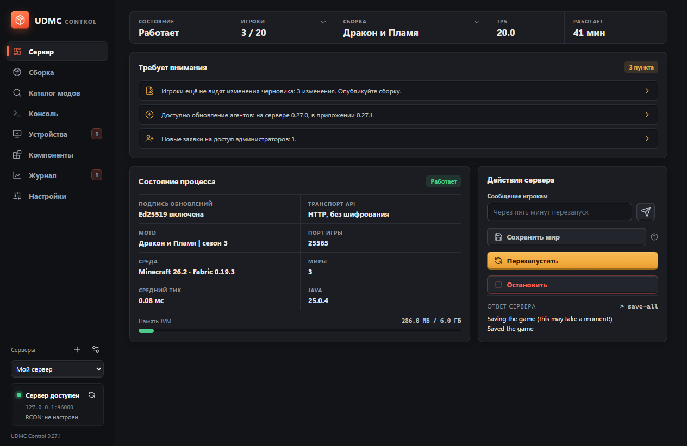
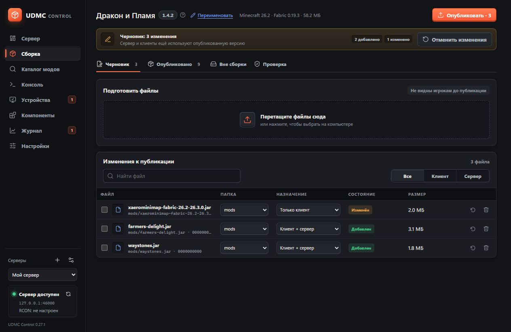
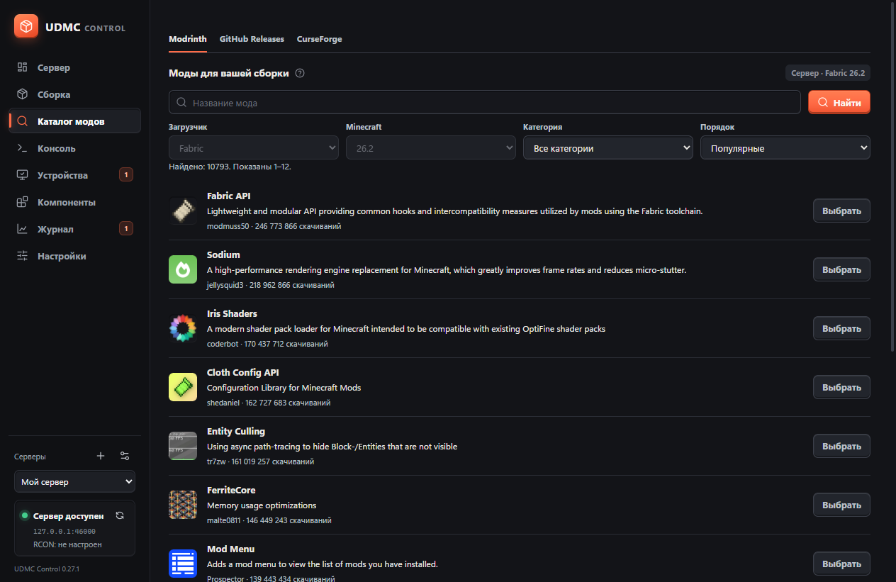
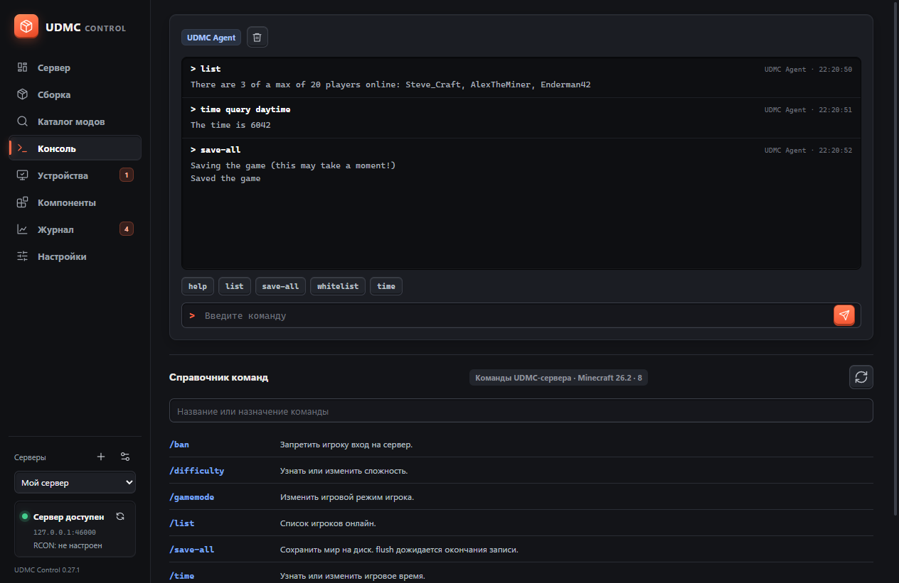
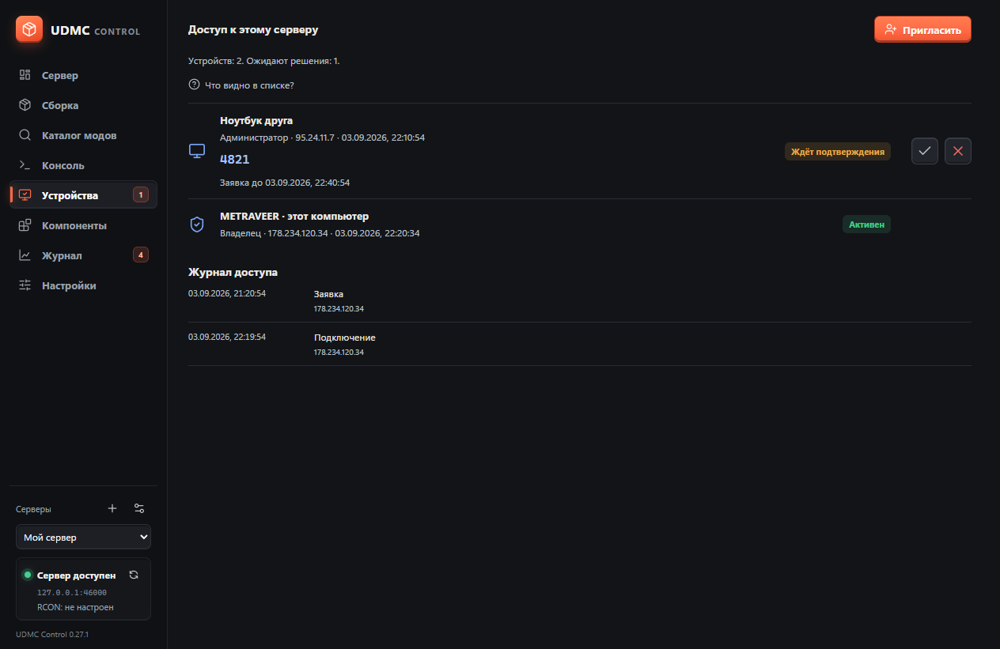
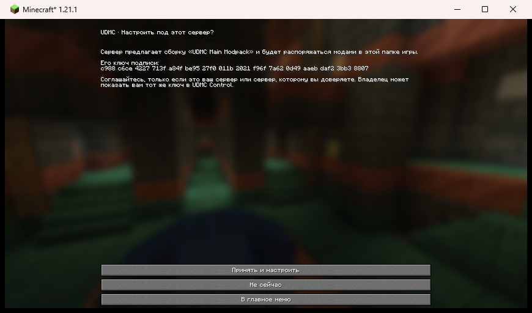

**Русский** · [English](README.md)

# UDMC

**Раздача модов Minecraft-сервера на компьютеры игроков — без отдельного лаунчера.**

Администратор собирает модпак в Windows-приложении, игроки получают его автоматически при запуске обычной игры.

**Fabric и NeoForge · Minecraft 1.21.1, 26.1.2, 26.2 · русский и английский интерфейс**

---

## Что это решает

Вы добавили мод на сервер — и дальше начинается знакомое: разослать архив в чат, объяснить, куда его положить, ловить тех, у кого «не запускается», и повторять это при каждом обновлении.

UDMC убирает этот шаг. Вы публикуете сборку в панели — игроки получают её сами при следующем запуске игры, с проверкой целостности файлов и без ручного копирования.

- **Никакого своего лаунчера.** Игроки играют через тот клиент, к которому привыкли, включая сторонние лаунчеры.
- **Каталоги модов внутри панели.** Modrinth, CurseForge и GitHub Releases — поиск, описания, скриншоты и установка в сборку в пару кликов.
- **Проверка совместимости до публикации.** Недостающие зависимости, дубликаты и неверные стороны находятся до того, как сервер упадёт.
- **Ничего лишнего у игроков.** Личные моды не удаляются, серверные файлы им не раздаются.
- **Один файл на всех.** Мод одинаковый для сервера и для игроков, секретов внутри нет — его можно просто выложить ссылкой.

## Быстрый старт за 5 шагов

1. **Скачайте** [последний установщик](../../releases/latest) и запустите его.
2. В приложении откройте **«Настройка сервера» → «Скачать мод»**, выберите версию игры и сохраните файл.
3. Положите файл в папку `mods` вашего сервера и запустите его. Сервер заведёт проект и напишет **код привязки** — в консоль и в `config/udmc-pairing.txt`.
4. Вернитесь в приложение, откройте **«Настройка сервера → Подключение»**, укажите адрес сервера и введите код. Если пароль RCON уже введён, поля для кода нет — вместо него кнопка, которая заберёт код сама.
5. Тот же самый файл отдайте игрокам. Он один на всех: сервер сам расскажет клиенту, что за сборка и откуда её брать. При первом входе игра задаёт один вопрос — с названием сборки и отпечатком её ключа подписи. До согласия ничего не записывается; после одного перезапуска сборка держит себя в порядке сама.

Готово: теперь всё, что вы публикуете в разделе «Сборка», приезжает к игрокам само.

У кода привязки нет срока годности, и перезапуски его не меняют — торопиться некуда. Он перестаёт работать в момент привязки.

Подробности — [полная инструкция по установке](docs/installation.md).

## Как выглядит

| Сборка и публикация | Каталог модов |
| --- | --- |
|  |  |
| **Консоль сервера** | **Администраторы** |
|  |  |

Что видит игрок при первом входе — один вопрос, и до согласия ничего не записывается:

## Возможности

**Сборка модпака**
- Черновик и публикация: изменения не видны игрокам, пока вы не опубликуете их.
- Проверка совместимости запускается сама при каждом изменении и после публикации.
- Она называет мод на сервере, который добавляет записи в реестры игры, но не выдаётся игрокам: без него игра отказывает каждому, у кого его нет, а UDMC не может выдать то, чего нет в сборке. Такие находки — предупреждения, публикацию они не блокируют.
- Файлы, попавшие на сервер мимо панели, можно взять под управление или оставить как есть.
- Назначение файлов: только сервер, только клиент или обе стороны.

**Каталоги модов**
- Modrinth и GitHub Releases — без ключей и регистрации.
- CurseForge — по личному бесплатному ключу API.
- Описания, скриншоты, зависимости и лицензии видны до установки.
- Зависимость, которая уже есть в сборке, не добавляется второй раз: та же версия пропускается, старая заменяется новой, а любую ненужную зависимость можно снять галочкой до добавления. То же правило для файлов, загруженных вручную, и для копий мода, лежащих на сервере мимо сборки.
- Кнопка перевода описаний на русский (по ключу Яндекс Переводчика).

**Управление сервером**
- Состояние процесса, TPS, память, игроки онлайн.
- Консоль с командами сервера и справочником; поддержка RCON.
- Остановка и перезапуск с отсчётом в чате для игроков.

**Совместная работа и безопасность**
- Приглашения для других администраторов с подтверждением по коду.
- Все изменения защищены от конфликтов при одновременной работе.
- Подпись обновлений Ed25519; ключ подписи создаётся на сервере и никогда не лежит в файле мода.
- Резервная копия проекта: потеря сервера не означает потерю доверия игроков.

## Документация

| Для кого | Документ |
| --- | --- |
| Только начинаю | [Установка и первый запуск](docs/installation.md) |
| Настраиваю сервер | [Конфигурация агента](docs/configuration.md), [Администраторы и доступ](docs/administrators.md) |
| Возникли вопросы | [Частые вопросы](docs/faq.md) |
| Разработчик | [Архитектура](docs/architecture.md), [API агента](docs/api.md), [Разработка и тесты](docs/development.md) |
| Планирую обновление | [Совместимость и версии](docs/compatibility-roadmap.md), [История изменений](CHANGELOG.md) |

## Требования

| Загрузчик | Minecraft | Java |
| --- | --- | --- |
| Fabric | 1.21.1 | 21+ |
| Fabric | 26.1.2, 26.2 | 25+ |
| NeoForge | 1.21.1 | 21+ |

Minecraft ниже 1.20.2 поддержан быть не может: проверка клиента при входе опирается на фазу
configuration, которой в тех версиях нет ([почему](docs/supported-minecraft-versions.md)).

Панель: Windows 10 или 11. Отдельно устанавливать Java, Node.js или Rust не нужно — всё необходимое встроено в приложение.

## Обновления

Приложение проверяет обновления при запуске и предлагает установить их одной кнопкой — загрузка и перезапуск происходят сами. Файлы раздаёт GitHub, поэтому обновления доступны всегда, независимо от компьютера автора. Каждый выпуск подписан: приложение не примет пакет без действительной подписи.

Агенты на сервере обновляются из панели: кнопка **«Обновить и перезапустить»** в разделе «Агенты и игроки». Клиенты игроков подтягивают новую версию сами при следующем запуске игры.

## Разработка с участием искусственного интеллекта

Проект разработан и поддерживается с активным использованием ИИ-ассистентов: они пишут код, тесты и документацию под управлением и с проверкой человека. Каждый выпуск проходит автоматические тесты (наборы Node, Rust и Java плюс матрица входа на настоящем сервере в CI) и ручную проверку на настоящих клиентах.

Мы считаем важным говорить об этом прямо: код открыт, история изменений подробна, а решения задокументированы — вы можете проверить любую часть сами.

## Участие в проекте

Идеи, отчёты об ошибках и правки приветствуются — см. [CONTRIBUTING.md](CONTRIBUTING.md). Об уязвимостях сообщайте по правилам из [SECURITY.md](SECURITY.md).

## Лицензия

[MIT](LICENSE). Minecraft, Fabric, NeoForge, Modrinth и CurseForge — товарные знаки соответствующих владельцев; проект с ними не аффилирован.
