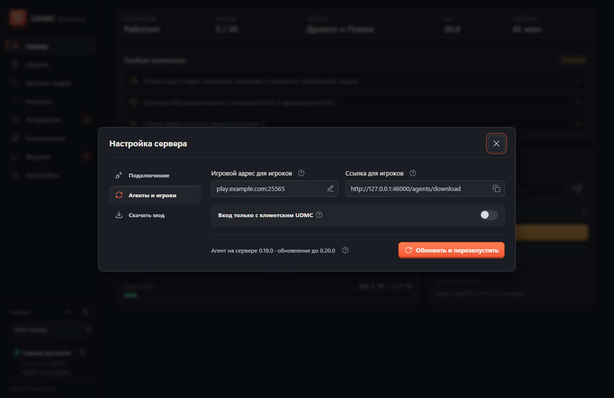
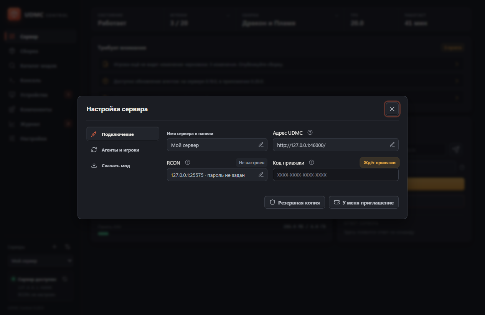

# Установка UDMC

UDMC Control ставит только администратор. Игрокам нужны Minecraft с выбранным Fabric или NeoForge и один файл мода — тот же самый, что стоит на сервере, — без отдельного приложения UDMC.

## 1. Установить Windows-приложение

Скачайте установщик со [страницы релизов](../../releases/latest) и запустите его. Если в Windows нет Microsoft Edge WebView2, установщик загрузит его; для этого нужен интернет. На экране **Компоненты** перечислены встроенные библиотеки, шаблоны агентов и ссылки на игровые зависимости.

Приложение ставится для текущего пользователя, поэтому права администратора Windows не требуются.

**Обновления приходят сами.** При запуске приложение проверяет наличие новой версии и показывает плашку сверху: одно нажатие — и оно скачает обновление, установит его и перезапустится. Пакеты подписаны ключом проекта; пакет без действительной подписи приложение не примет. Ручная установка новым установщиком тоже работает — настройки и ключи сохраняются. Переход на более старую версию запрещён.

Если раньше приложение было установлено «для всех пользователей» (версии до 0.15.0), удалите ту копию один раз через «Параметры → Приложения», иначе в системе останутся две.

**Java, Rust, Node.js и Gradle не нужны на компьютере администратора.** Java нужна только там, где запускается Minecraft. Шаблоны JAR, ZIP, подпись и RCON уже включены в установщик.

Повторный запуск открывает уже работающее окно, в том числе свёрнутое. Перед обновлением со старой версии закройте все её окна: защита второго экземпляра появилась в 0.2.4.

Обновление панели сохраняет прежний выбор загрузчика. Агент на сервере обновляется из раздела **«Агенты и игроки»**; файл при этом заменяется при остановленном сервере или клиенте, и старый рядом не оставляют. Добавление NeoForge не требует переводить существующий Fabric-сервер на другой загрузчик.

## 2. Взять файл мода

1. Откройте **Настройка сервера → Скачать мод**.
2. Выберите загрузчик и версию Minecraft. Доступны Fabric `1.21.1` (Java 21), `26.1.2` и `26.2` (Java 25) с Loader `0.19.3`, а также NeoForge `1.21.1` / `21.1.248` (Java 21). Версия загрузчика выводится из этой пары и не выбирается отдельно. NeoForge 26.x и Forge пока недоступны.

   Когда панель уже говорит с сервером, выбирать нечего: списки показывают версию сервера и заперты, чтобы файл наверняка подошёл именно ему. Выбор появляется, только пока сервера нет — например, когда мод скачивают до его первого запуска.
3. Нажмите **Сохранить файл** и выберите папку.

Файл один и тот же для сервера и для игроков. Внутри нет ни ключей, ни адресов, ни названия
проекта: всё это создаётся на самом сервере при первом запуске, а игрокам сервер рассказывает
о себе сам, когда они заходят. Поэтому файл можно раздавать как угодно — выложить ссылкой,
отправить в чат, положить рядом с описанием сервера. Готовую ссылку на него панель
показывает в разделе **Настройка сервера → Агенты и игроки** — рядом с игровым адресом,
который увидят игроки, и правилом входа.



Рядом с файлом сохраняется `INSTALL.txt` с версиями и краткой инструкцией. Секретов в нём нет.

### Защищённые настройки

Адрес UDMC и подключение RCON редактируются карандашом внутри поля. В отдельном окне есть предупреждение, **Применить** и **Отмена**; закрытие через Escape также отменяет ввод. До применения прежние значения остаются рабочими. После применения настройки сохраняются, а поля снова показывают значение и не принимают ввод, в том числе после перезапуска Control.

Пароль RCON сохраняется в хранилище учётных данных Windows сразу и отдельно для каждого сервера в панели: отдельного вопроса «запомнить ли» больше нет, как нет и переключателя «использовать RCON». Консоль используется, когда есть чем до неё достучаться, — адрес, порт и пароль; стёртый пароль возвращает выполнение команд агенту.

Ключ подключения лежит в окне **Резервная копия**: он нужен ровно в одном случае — панель на новом компьютере, а пригласить вас некому. Тогда туда вставляют ключ восстановления из копии проекта.

Если данные успели измениться в фоне, редактор попросит закрыть окно и проверить актуальные значения. Версия игры выбирает, какой файл выдаст панель, и не перенастраивает уже запущенные сервер или игру. Ручная смена ключа подключения не меняет ключи на сервере.

## 3. Поднять сервер и привязать его

1. Установите сервер Fabric или NeoForge и Java для выбранной версии Minecraft. Для NeoForge используйте официальный установщик `21.1.248` для Minecraft `1.21.1`; установите сервер в отдельную папку и запускайте созданным установщиком `run.bat` / `run.sh`. Прочитайте и самостоятельно примите Minecraft EULA при первом запуске.
2. Остановите сервер. Положите файл мода в `<server>/mods/`. Удалите прежний JAR агента, не оставляйте два экземпляра.
3. Запустите сервер. При первом запуске он заводит проект — пару ключей для подписи сборки и ключ доступа — и выдаёт **код привязки**.
4. Найдите код. Он один и тот же во всех четырёх местах:
   - в консоли сервера при запуске;
   - в файле `<server>/config/udmc-pairing.txt`;
   - в ответе команды `udmc pair`, выполненной по RCON;
   - в игре: `/udmc pair` от оператора.
5. В панели откройте **Настройка сервера → Подключение**, укажите адрес UDMC и введите код в поле **Код привязки**. Кнопка появляется в самом поле, как только в нём что-то набрано. Если пароль RCON уже введён, поля нет вовсе — на его месте кнопка **«Привязать по RCON»**: код панель заберёт сама. Рядом ссылка **«Ввести код вручную»** на случай, если консоль его не отдала.
6. Панель сразу сообщает серверу адрес, по которому до него дозвонилась: именно его сервер называет игрокам, когда они заходят.



У кода нет срока годности, и перезапуски его не меняют: он лежит в конфиге сервера. Спешить
некуда — привязать можно через час или через неделю. Код перестаёт работать в момент привязки,
и файл с ним исчезает. Если сервер привязали не туда или панель потерялась, поставьте
`resetPairing` в `config/udmc-sync.json` и перезапустите сервер: появится новый код, а прежние
панели потеряют доступ.

Файл с кодом лежит рядом с конфигом и никогда не отдаётся по HTTP.

7. Настройте домен, сертификат и HTTPS reverse proxy к API. Внешний порт обычно `443`, внутренний UDMC `3077`.

Порт и адрес прослушивания агента — настройки сервера: `apiPort` и `apiHost` в
`config/udmc-sync.json`. Их правят до запуска или с перезапуском; в файл мода они больше не
запекаются, поэтому смена порта никого не заставляет переустанавливать мод.

Публично нужны `GET /health`, `GET /manifest` и `GET /files/*`. `/admin/*` требует ключ; `/access/*` используется для приглашений и их проверки. Дополнительно ограничьте оба административных префикса доверенными IP или VPN и разрешите доступ приглашённому компьютеру. Прокси должен сохранять заголовок `x-udmc-signature`, не менять тело `/manifest`, не кэшировать manifest и ответы доступа, принимать загрузки до 512 МиБ. Настройте лимиты частоты и длительности запросов.

Если прокси работает на другой машине или в другом контейнере, `127.0.0.1` не будет адресом агента. Выберите **На всех интерфейсах** и настройте firewall, разрешающий доступ только прокси.

### Локальная сеть без HTTPS

Для доверенной LAN можно указать `192.168.1.50:3077` и явно разрешить HTTP в редакторе адреса перед нажатием **Применить**. Сетевые параметры определятся автоматически; адрес и разрешение общие для Control и генератора JAR. При вводе другого адреса разрешение сбрасывается. Подпись защищает клиентские обновления от подмены, но HTTP не скрывает токен и файлы. Для интернета этот режим не подходит.

Сервер на том же компьютере — это `http://127.0.0.1:3077`; адрес указывают в редакторе и применяют. Это не публичный адрес для игроков. Если сервер стоит дома, перед созданием клиентских JAR укажите внешний адрес, LAN-адрес или адрес VPN, доступный игрокам. UDMC не настраивает роутер, DNS, сертификаты и брандмауэр автоматически. Поля с вопросительным знаком раскрывают краткие объяснения.

### Почему отдельный порт

Minecraft, RCON и HTTP используют разные протоколы. Текущий агент не разделяет TCP-порт с игровым или RCON-сервером. Стандартные `25565` и `25575` не используются для API. Укажите свободный внутренний порт. Если он занят, API не запустится; причина появится в `logs/latest.log`. С HTTPS-прокси пользователям достаточно обычного порта `443`; открывать `3077` наружу не обязательно.

## 4. Установить клиент

1. Установите тот же загрузчик и Minecraft, что на сервере, в отдельный игровой профиль. Для NeoForge 1.21.1 выберите `21.1.248` и Java 21. Не смешивайте Fabric- и NeoForge-моды.
2. При закрытой игре положите файл мода в папку `mods` этого профиля — тот же самый файл, что стоит на сервере. Старый агент замените.
3. Запустите игру и зайдите на сервер.
4. Сервер представится: название сборки и отпечаток своего ключа подписи. Игра покажет экран **«Настроить под этот сервер?»**. Соглашаться стоит, только если это ваш сервер или сервер, которому вы доверяете: после согласия он распоряжается модами в этой папке игры. Отпечаток можно сверить с тем, что владелец видит в UDMC Control.
5. После согласия UDMC скачает сборку и попросит перезапустить игру. Дальше клиент синхронизируется сам при каждом запуске, и заходить куда-либо больше не нужно.

Конфиг и токены игрок не вводит. UDMC не устанавливает Minecraft, Java или загрузчик и не запускает игру автоматически.

Одна папка игры — одна сборка. Два сервера с UDMC не могут делить `mods`, поэтому второй
получит понятный отказ с советом завести отдельный профиль игры. Если ключ подписи сервера
однажды изменится, клиент не применит ничего молча: он скажет об этом и попросит подтвердить
у владельца.

## 5. Управлять сборкой

1. На странице **Сборка** перетащите файлы или выберите их нажатием на область добавления.
2. Проверьте папку и сторону каждого файла: `client` для игроков, `server` для сервера, `both` для обоих. Для массового назначения есть селекты над списком.
3. **Добавить в черновик** сохраняет подготовленные файлы, но не раздаёт их и не меняет установку сервера.
4. В таблице можно изменить назначение, удалить файл или отменить изменение.
5. **Опубликовать** применяет весь черновик. После изменения серверных модов перезапустите сервер; клиенты синхронизируются при следующем запуске игры.

Разрешены `mods/`, `config/`, `resourcepacks/`, `shaderpacks/`. Максимум файла 512 МиБ; локальный анализ ZIP/JAR ограничен 64 МиБ. Для ручной загрузки NeoForge-JAR и слишком больших JAR нужно выбрать сторону: TOML не описывает надёжно назначение всего файла. Перед публикацией сервер проверяет метаданные своего загрузчика, стороны зависимостей, обязательные зависимости, заявленные несовместимости и дубли ID, включая вложенные моды. При обновлении JAR с новым именем добавьте новый и удалите старый из черновика перед публикацией. Проверка метаданных не гарантирует отсутствие ошибок внутри модов или сохранность мира.

NeoForge-проверка поддерживает `javafml`, `lowcodefml`, Maven-диапазоны версий, порядок загрузки, несколько модов в одном JAR и Jar-in-Jar. Неизвестный языковой загрузчик, конфликт встроенных библиотек или разные встроенные версии одного мода останавливают публикацию для ручной проверки. Требования к OpenGL, функции модов и поведение их кода не анализируются. Не отключайте проверку ради принудительной установки: сначала испытайте совместимый набор отдельно.

### Каталог Modrinth

1. Откройте **Каталог модов**: популярные моды загрузятся сразу, без поиска и без подключённого игрового клиента. Без агента выберите загрузчик и Minecraft в каталоге; при подключении оба определяются сервером.
2. При необходимости введите название и нажмите **Найти**, смените сортировку или страницу. Для добавления подключите обновлённый серверный агент.
3. Выберите мод и версию. По умолчанию выбирается стабильный релиз.
4. Нажмите **Подобрать зависимости**: появятся обязательные моды, их назначение, версии и имена файлов.
5. Нажмите **Добавить в черновик**. Сначала скачиваются и проверяются все файлы, потом они отправляются на сервер. Публикации на этом шаге нет.
6. Проверьте раздел **Сборка** и опубликуйте изменения.

Вход в аккаунт не нужен. Поддерживаются Fabric- и NeoForge-моды для встроенных профилей, до 48 файлов и 256 МиБ за операцию, каждый JAR до 64 МиБ. Назначение берётся из данных автора на Modrinth. Проверяются HTTPS, официальный CDN, размер и SHA-512. Внешние обязательные зависимости, неоднозначные версии, циклы и неизвестное назначение останавливают импорт. Необязательные и уже встроенные зависимости отдельно не скачиваются. Существующий файл с другим содержимым не заменяется молча; при новом имени старую версию нужно убрать в черновике.

При обрыве отправки часть файлов может остаться в черновике; интерфейс сообщает количество. Они не опубликованы. Просмотрите черновик перед повторным импортом. Авторские лицензии и разрешение на распространение модов остаются ответственностью администратора. Поиск и скачивание раскрывают Modrinth ваш IP и поисковый запрос, но не передают токен UDMC или серверные ключи.

### Уже установленные файлы

**Сборка → Файлы на сервере → Проверить** перечисляет неуправляемые файлы разрешённых папок. Выберите сторону и нажмите **Принять**. Сначала опубликуйте добавление: UDMC начнёт учитывать файл. После этого его можно убрать обычным удалением из сборки и новой публикацией.

Конфиги могут содержать пароли: не раздавайте их клиентам без проверки. Конфиг UDMC и его JAR исключаются из импорта и загрузки.

Личные клиентские файлы не удаляются автоматически. Идентичный JAR с тем же SHA-256 переиспользуется даже под другим именем и помечается как личный: последующее удаление из сборки не удаляет его с диска. Одного совпадения названия или версии недостаточно для доверия другому содержимому.

При конфликте окно UDMC показывает конкретный файл и причину. **Убрать с копией** требует подтверждения и убирает только выбранный файл, сохраняя его в `udmc-sync/backups/<ID>/`. Повторно проверяется хеш, чтобы не удалить файл, изменённый после показа окна. Нужен перезапуск для новой проверки; альтернативно можно убрать файл вручную. Для восстановления закройте игру и верните нужную копию в исходную папку, убрав суффикс `.disabled`.

Если конфликт помешал загрузчику запустить игру, окно UDMC ещё не сможет открыться: сначала исправьте ошибку загрузчика вручную. Личные моды с неизвестными метаданными требуют ручной проверки. Проверка не заменяет тестовый запуск сервера и клиента.

### Безопасность мира

Перед удалением модов сделайте резервную копию мира, особенно если мод добавляет блоки, предметы или измерения. Панель предупреждает о риске, но не доказывает безопасность конкретного набора. При обрабатываемой ошибке записи UDMC пытается восстановить файлы из временных копий. Это не защита от выключения питания и не резервная копия мира.

На Windows игра может удерживать JAR. Если файл занят, операция завершится ошибкой; может потребоваться замена при остановленной игре/сервере вручную. Внешний процесс для применения обновлений после выхода пока не реализован.

## 6. RCON и команды

Для консоли через UDMC Agent RCON не обязателен. Для стандартного RCON настройте `server.properties`:

```properties
enable-rcon=true
rcon.port=25575
rcon.password=replace-with-a-long-random-secret
broadcast-rcon-to-ops=false
```

После перезапуска сервера откройте **Консоль → Подключение RCON**, нажмите карандаш, включите RCON, укажите домен/IP без протокола, порт и пароль, затем **Применить**. Это сохраняет настройки, но не проверяет соединение. **Проверить** и выполнение команды обновляют индикаторы в консоли и сайдбаре. Соединение открывается на время команды: **Доступен** означает успешную последнюю проверку, не постоянный сокет. Через минуту индикатор просит повторить проверку.

Пароль запоминается только по выбранному параметру в Windows Credential Manager. RCON не шифруется: используйте VPN, SSH-туннель или консоль UDMC по HTTPS.

RCON ждёт подключения и ответа до 15 секунд. Обрезанный или слишком большой ответ считается ошибкой. При обрыве связи команда могла выполниться: проверьте сервер перед повтором, особенно для остановки и изменения мира. То же правило действует при тайм-ауте публикации через агент; автоматического повтора нет.

Справочник получает названия и синтаксис из диспетчера команд UDMC-сервера. Для известных команд есть русские описания, для команд модов только доступный синтаксис. Кнопка рядом с синтаксисом вставляет его без выполнения. Замените `<аргументы>` реальными значениями. Если RCON направлен на другой сервер, справочник не описывает тот сервер; используйте его `help`.

## 7. Перезапуск сервера

Готовый wrapper ниже предназначен для Fabric. Для NeoForge используйте supervisor или автоперезапуск в панели хостинга с командой из штатного `run.bat` / `run.sh`. Не переименовывайте установщик NeoForge в `fabric-server-launch.jar`. UDMC умеет запросить остановку и записать маркер, но не заменяет внешний запускатель.

1. Скопируйте `run-udmc-server.bat` или `run-udmc-server.sh` из `minecraft/server-wrapper/` рядом с `fabric-server-launch.jar`.
2. Запускайте сервер через wrapper.
3. Нажмите **Перезапустить** на странице **Сервер**. Отдельного разрешения в конфиге больше нет: тот, у кого есть доступ к панели, и так может напечатать `stop` в консоли.

Wrapper запускает сервер снова при наличии `udmc-sync/restart-requested`. Вместо него можно использовать supervisor или панель хостинга. Сервер не может запустить себя после завершения процесса. Обычная остановка завершает цикл wrapper.

## 8. Переход на один мод для всех

До 0.20 панель собирала два разных файла: серверный с ключами внутри и клиентский с адресом
проекта. Теперь файл один и пустой, а проект живёт на сервере. Что делать:

1. Сохраните копии модов, конфигов, мира и `udmc-sync`.
2. Обновите Control и возьмите новый файл в разделе **«Скачать мод»**.
3. Замените им серверный JAR при остановленном сервере и запустите сервер. Прежний
   `config/udmc-sync.json` остаётся на месте — проект, ключи и доступ никуда не денутся, и
   привязываться заново не нужно: сервер уже ваш.
4. Раздайте тот же файл игрокам взамен их клиентских JAR.

Клиенты прежних версий на новый сервер не зайдут: они отвечают на вопрос по-старому и получат
понятный отказ со ссылкой, откуда взять новый файл. Это осознанное решение — держать две схемы
одновременно значило бы держать и обе ветки проверки входа.

Файл со встроенными настройками сервер теперь отвергает: это может быть только старый
персональный файл, а такие носили внутри токен и ключ подписи.

## Несколько администраторов и переход с 0.2.1

Владелец создаёт приглашение в **Устройствах**, друг подаёт заявку в **Настройка сервера → Подключение → «У меня приглашение»**, владелец подтверждает её после сверки кода. Код привязки для этого не нужен: он тратится один раз, когда сервер впервые берут под управление. Файл мода у игроков менять не требуется. Полная инструкция и восстановление доступа: [administrators.md](administrators.md).

Защита настроек в 0.2.3 требует только обновления Control. Агенты 0.2.2 совместимы, заменять их ради кнопок редактирования не нужно.

## Удаление UDMC

Закройте игру/сервер, сохраните нужные данные и удалите JAR агента, `config/udmc-sync.json` и `udmc-sync/`. Уже установленные моды и конфиги автоматически не удаляются. Сохраняйте приватную резервную копию серверного JAR, пока проект используется.
